# AI Automation Portfolio — Architecture Overview

## System Architecture (Mermaid)

```mermaid
flowchart TD
    %% ===== ORCHESTRATOR LAYER =====
    subgraph ORCH[Orchestrator Layer]
        direction TB
        AMTeam[AI Marketing Team Orchestrator<br/>GPT-4.1 via OpenRouter<br/>Telegram Trigger + Memory]
        ThinkOrch[Think Agents Orchestrator<br/>Multi-LLM: GPT-4.1, Claude 3.5, Gemini 2.0, DeepSeek R1<br/>7 Tools: Think, Pinecone RAG, Gmail, Airtable, Tavily, Calendar]
    end

    %% ===== TOOL WORKFLOWS (Called by Orchestrator) =====
    subgraph TOOLS[Modular Tool Workflows — Callable as Tools]
        direction TB
        BlogTool[Blog Post Tool<br/>Tavily Research → GPT-4.1 Writer → Image Prompt Agent → gpt-image-1<br/>Google Drive + Sheets Logging]
        LinkedInTool[LinkedIn Post Tool<br/>Tavily Research → GPT-4.1 Writer → Image Prompt Agent → gpt-image-1<br/>Google Drive + Sheets Logging]
        CreateImg[Create Image Tool<br/>GPT-4.1 Prompt → gpt-image-1 → Drive Upload]
        EditImg[Edit Image Tool<br/>GPT-4.1 Prompt → gpt-image-1 Edit → Drive Upload]
        SearchImg[Search Images Tool<br/>Pinecone Vector Search → Return Matches]
    end

    %% ===== QUALITY LOOP =====
    subgraph QUALITY[Evaluator-Optimizer Quality Loop]
        direction TB
        Generator[Generator Agent<br/>GPT-4o-mini]
        Evaluator[Evaluator Agent<br/>Criteria: Quote, Humor, No Emojis]
        Optimizer[Optimizer Agent<br/>GPT-4o-mini / DeepSeek R1]
        Control{Finished?}
        Docs[Google Docs Output]
    end

    %% ===== RAG PIPELINE =====
    subgraph RAG[RAG Knowledge Base]
        direction TB
        Ingest[Data Ingestion Pipeline<br/>Google Drive → Extract → Chunk → Embed → Pinecone]
        VoiceRAG[Voice RAG Agent<br/>Webhook → Agent → Pinecone Tool → Respond]
        ThinkRAG[Think Agents RAG Tool<br/>Pinecone Vector Store Tool]
    end

    %% ===== CONTENT AUTOMATION =====
    subgraph CONTENT[SEO Content Automation]
        direction TB
        Newsletter[Newsletter Service<br/>Weekly Cron → Fetch Posts → AI Draft → Mailchimp]
        SocialMedia[Social Media Automation<br/>Daily Cron → AI Caption → Canva → Instagram]
        Analytics[Analytics & Reporting<br/>Daily Cron → GA → AI Summary → Email]
    end

    %% ===== INTEGRATIONS =====
    subgraph EXT[External Integrations]
        direction TB
        LLMs[LLMs: GPT-4.1, GPT-4o-mini, Claude 3.5, Gemini 2.0, DeepSeek R1]
        VectorDB[Pinecone Vector DB]
        Google[Google: Sheets, Drive, Docs, Calendar, Gmail, Analytics]
        Airtable[Airtable Contacts]
        Tavily[Tavily Web Search]
        Telegram[Telegram Bot]
        Canva[Canva API]
        Mailchimp[Mailchimp]
        OpenAIImg[OpenAI gpt-image-1]
    end

    %% CONNECTIONS
    AMTeam -->|tool call| BlogTool
    AMTeam -->|tool call| LinkedInTool
    AMTeam -->|tool call| CreateImg
    AMTeam -->|tool call| EditImg
    AMTeam -->|tool call| SearchImg

    BlogTool --> Tavily
    BlogTool --> LLMs
    BlogTool --> OpenAIImg
    BlogTool --> Google
    LinkedInTool --> Tavily
    LinkedInTool --> LLMs
    LinkedInTool --> OpenAIImg
    LinkedInTool --> Google
    CreateImg --> LLMs
    CreateImg --> OpenAIImg
    CreateImg --> Google
    EditImg --> LLMs
    EditImg --> OpenAIImg
    EditImg --> Google
    SearchImg --> VectorDB

    ThinkOrch -->|tool| ThinkRAG
    ThinkOrch -->|tool| Tavily
    ThinkOrch -->|tool| Google
    ThinkOrch -->|tool| Airtable

    Generator --> Evaluator
    Evaluator -->|not finished| Control
    Control -->|no| Optimizer
    Optimizer --> Generator
    Control -->|yes| Docs

    Ingest --> Google
    Ingest --> LLMs
    Ingest --> VectorDB
    VoiceRAG --> VectorDB
    VoiceRAG --> LLMs
    ThinkRAG --> VectorDB

    Newsletter --> LLMs
    Newsletter --> Mailchimp
    SocialMedia --> LLMs
    SocialMedia --> Canva
    Analytics --> Google
    Analytics --> LLMs

    %% STYLING
    classDef orchestrator fill:#1e3a5f,stroke:#3b82f6,stroke-width:2px,color:#fff
    classDef tool fill:#064e3b,stroke:#10b981,stroke-width:2px,color:#fff
    classDef quality fill:#7c2d12,stroke:#f97316,stroke-width:2px,color:#fff
    classDef rag fill:#4c1d95,stroke:#a855f7,stroke-width:2px,color:#fff
    classDef content fill:#1f2937,stroke:#6b7280,stroke-width:2px,color:#fff
    classDef ext fill:#374151,stroke:#9ca3af,stroke-width:1px,color:#fff

    class AMTeam,ThinkOrch orchestrator
    class BlogTool,LinkedInTool,CreateImg,EditImg,SearchImg tool
    class Generator,Evaluator,Optimizer,Control,Docs quality
    class Ingest,VoiceRAG,ThinkRAG rag
    class Newsletter,SocialMedia,Analytics content
    class LLMs,VectorDB,Google,Airtable,Tavily,Telegram,Canva,Mailchimp,OpenAIImg ext
```

---

## Key Architectural Patterns Demonstrated

### 1. **Modular Tool Workflow Pattern** (`AI_Marketing_Team`)
- Master orchestrator agent delegates to **5 specialized sub-workflows** exposed as callable tools
- Each tool workflow: defined inputs/outputs, versioned, reusable, independently testable
- Teams invoke via Telegram/chat/API without touching n8n canvas

### 2. **Evaluator-Optimizer Quality Loop** (`Evaluator Optimizer`)
- Generator → Evaluator (criteria-based) → Optimizer → loop until "Finished"
- Eliminates manual review; guarantees output meets explicit standards
- Pushes final to Google Docs for audit trail

### 3. **RAG-as-a-Tool Pattern** (`Data_to_Pinecone` + `Voice_RAG_Agent` + `Think_Agents`)
- Ingestion pipeline: Drive → Extract → Chunk → Embed (text-embedding-3-small) → Pinecone
- Retrieval exposed as **tool** to any agent (VectorStoreTool)
- Voice/webhook interface for hands-free querying

### 4. **Multi-LLM Orchestration** (`Think_Agents`)
- 4 LLMs (GPT-4.1, Claude 3.5, Gemini 2.0, DeepSeek R1) + Think tool
- 7 tools: Pinecone RAG, Gmail, Airtable, Tavily, Calendar, Email, Think
- Agent self-verifies via Think tool before acting

### 5. **Governed Content Pipeline** (`Blog_Post`, `LinkedIn_Post`)
- Real-time research (Tavily) → Target-audience-aware writing → AI image prompts → gpt-image-1
- **Full audit log in Google Sheets**: topic, audience, output, image prompt, Drive link, timestamp
- Leadership visibility into every request → output → asset

### 6. **Scheduled Automation with AI** (`Analytics_Reporting`, `Newsletter_Service`, `Social_Media_Automation`)
- Cron triggers → data fetch → AI transformation → delivery (email, Mailchimp, Instagram)
- AI summarization/creation at each step